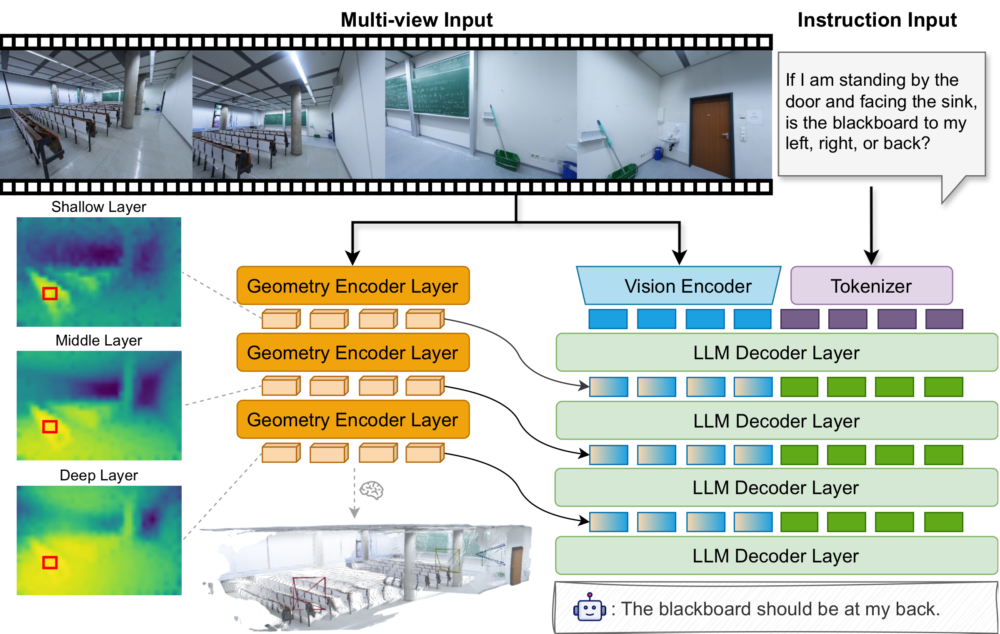

<div align="center">

# SpatialStack: Layered Geometry-Language Fusion for 3D VLM Spatial Reasoning (CVPR 2026)

<a href="https://jzh15.github.io/">Jian Zhang</a><sup>1</sup><sup>&ast;</sup>, <a href="https://shijiezhou-ucla.github.io/">Shijie Zhou</a><sup>2,3</sup><sup>&ast;</sup>, <a href="https://pages.cs.wisc.edu/~bangya/">Bangya Liu</a><sup>4</sup><sup>&ast;</sup>, <a href="https://visual.ee.ucla.edu/">Achuta Kadambi</a><sup>2</sup>, <a href="https://zhiwenfan.github.io/">Zhiwen Fan</a><sup>5</sup>

<sup>1</sup> XMU, <sup>2</sup> UCLA, <sup>3</sup> Google, <sup>4</sup> UW-Madison, <sup>5</sup> TAMU  
<sup>&ast;</sup> Equal contribution.

</div>

<p align="center">
  <a href="https://arxiv.org/abs/2603.27437"></a> &nbsp;&nbsp;&nbsp;&nbsp;
  <a href="https://spatial-stack.github.io/"></a> &nbsp;&nbsp;&nbsp;&nbsp;
  <a href="https://huggingface.co/Journey9ni/SpatialStack-Qwen3.5-4B"></a> &nbsp;&nbsp;&nbsp;&nbsp;
  <a href="https://huggingface.co/datasets/Journey9ni/SpatialStackData"></a> &nbsp;&nbsp;&nbsp;&nbsp;
  <a href="./LICENSE"></a>
</p>

## News

- 2026-04-10: Added Qwen3.5 training, evaluation, and inference support.
- 2026-02-21: Our paper has been accepted to CVPR 2026. See you in Denver!

## Overview


SpatialStack progressively aligns vision, geometry, and language representations across model layers, moving beyond single-stage late fusion and improving both local geometric precision and global spatial semantics.

### Key Contributions

- **Systematic Analysis of Fusion Layers.** Layer-wise analysis of fusion across vision encoder, geometry encoder, and LLM decoder, revealing a hierarchical geometry-language correspondence.
- **SpatialStack Framework.** A hierarchical fusion design that progressively aligns multi-level geometric and language features for joint local-global spatial reasoning.
- **VLM-SpatialStack Realization.** A concrete geometry-aware multimodal LLM with state-of-the-art performance on diverse 3D spatial reasoning benchmarks.

### Model Architecture



## TODO List

- [x] ~~Support training, inference, and evaluation based on Qwen3.5.~~

---

## Setup

> This public branch documents Qwen3.5 only.
> Validated with **Python 3.12**, **PyTorch 2.10.0+cu129**, **flash_attn 2.8.3**.
> Run all commands from the repository root.

### 1. Create conda environment

```bash
conda create -n spatialstack-qwen35 python=3.12 -y
conda activate spatialstack-qwen35
```

<details>
<summary>Install Miniconda first (if needed)</summary>

```bash
curl -L https://repo.anaconda.com/miniconda/Miniconda3-latest-Linux-x86_64.sh -o /tmp/miniconda.sh
bash /tmp/miniconda.sh -b -p "$HOME/miniconda3"
source "$HOME/miniconda3/bin/activate"
```
</details>

### 2. Install PyTorch for CUDA 12.9

```bash
pip install torch==2.10.0 torchvision==0.25.0 torchaudio==2.10.0 \
  --index-url https://download.pytorch.org/whl/cu129
```

> Ensure CUDA 12.9 is available in your environment before installing
> `flash_attn`.

### 3. Install flash_attn

```bash
pip install psutil ninja wheel setuptools packaging
pip install flash_attn==2.8.3 --no-build-isolation
```

### 4. Install Qwen3.5 dependencies

```bash
pip install --upgrade transformers==5.3.0 accelerate==1.13.0 qwen_vl_utils==0.0.14 decord
pip install -U git+https://github.com/Dao-AILab/causal-conv1d --no-build-isolation
pip install -U git+https://github.com/fla-org/flash-linear-attention
```

### 5. Install this repository

```bash
pip install -e . --no-deps
```

### 6. Verify installation

```bash
python - <<'PY'
import torch, transformers, qwen_vl_utils, causal_conv1d, fla, decord
print("torch", torch.__version__, "cuda", torch.version.cuda)
print("transformers", transformers.__version__)
print("qwen_vl_utils", qwen_vl_utils.__version__)
print("causal_conv1d", causal_conv1d.__version__)
print("fla", fla.__version__)
print("decord", decord.__version__)
PY
```

<details>
<summary>Additional packages for lmms_eval (optional)</summary>

```bash
pip install datasets pyarrow evaluate pytablewriter pandas \
  loguru jsonlines sqlitedict sacrebleu terminaltables zss tenacity==8.3.0 \
  wandb openai tiktoken scipy openpyxl numexpr sympy nltk sentencepiece ftfy \
  timm opencv-python-headless av tqdm-multiprocess transformers-stream-generator \
  hf_transfer
```
</details>

---

## Model Weights

| Model | Base | Geometry Encoder | Size | Path / HF ID |
|---|---|---|---|---|
| SpatialStack-Qwen3.5-4B | Qwen3.5-4B | VGGT-1B, layers [11,17,23] -> [0,1,2] | 14 GB | `Journey9ni/SpatialStack-Qwen3.5-4B` |

---

## Inference

```bash
python scripts/inference/infer.py \
  --model-path Journey9ni/SpatialStack-Qwen3.5-4B \
  --image assets/sofas.jpg \
  --prompt "Describe this scene in a few complete sentences." \
  --disable-thinking \
  --max-new-tokens 128
```

**Options:**

| Flag | Description |
|---|---|
| `--model-path` | HF model id or local checkpoint path |
| `--image` / `--image-dir` / `--video` | Input visual (mutually exclusive, required) |
| `--disable-thinking` | Skip reasoning trace, output final answer directly |
| `--max-new-tokens` | Default 512. Use ~1024 if thinking mode is enabled |
| `--no-flash-attn2` | Fall back to non-FlashAttention path |
| `--add-frame-index` | Insert `Frame-i:` tokens before each image |

<details>
<summary>Run with the stock Qwen3.5 base model (no SpatialStack weights)</summary>

```bash
python scripts/inference/infer.py \
  --model-path Qwen/Qwen3.5-4B \
  --image assets/sofas.jpg \
  --prompt "Describe this scene in a few complete sentences." \
  --disable-thinking \
  --max-new-tokens 128
```
</details>

---

## Evaluation

```bash
MODEL_PATH=Journey9ni/SpatialStack-Qwen3.5-4B \
MODEL_IMPL=qwen3_5 \
MODEL_ARGS_BASE="pretrained=Journey9ni/SpatialStack-Qwen3.5-4B,disable_thinking=true,max_num_frames=32,max_length=12800" \
OUTPUT_ROOT=logs/eval/spatialstack_qwen35_4b \
BENCHMARKS="vsibench" \
bash scripts/evaluation/eval.sh
```

Available benchmarks: `vsibench`, `cvbench`, `blink_spatial`, `sparbench`, `videomme`, `mmsibench` (comma-separated).

<details>
<summary>All eval parameters</summary>

| Variable | Description |
|---|---|
| `MODEL_PATH` | HF model id or local checkpoint path |
| `MODEL_IMPL` | Model implementation (`qwen3_5`, `spatialstack`) |
| `OUTPUT_ROOT` | Root directory for evaluation outputs |
| `BENCHMARKS` | Comma-separated benchmark list |
| `CUDA_VISIBLE_DEVICES` | Select visible GPU ids |
| `NUM_MACHINES` / `PROCESSES_PER_MACHINE` / `MACHINE_RANK` | Distributed launch settings |
| `MASTER_ADDR` / `MASTER_PORT` | Multi-node rendezvous settings |

Outputs: `*_results.json` (aggregated metrics), `*_samples_<task>.jsonl` (per-sample logs).
</details>

---

## Training

See [TRAINING.md](./TRAINING.md) for the full training workflow, including data preparation and launch settings.

### SpatialStack geometry training

The released `Journey9ni/SpatialStack-Qwen3.5-4B` checkpoint is geometry-enabled:
it uses VGGT-1B with geometry layers `[11, 17, 23]` fused into language layers
`[0, 1, 2]`.

Train SpatialStack from the `Qwen/Qwen3.5-4B` base model with geometry enabled:

```bash
MODEL_PATH=Qwen/Qwen3.5-4B \
USE_GEOMETRY_ENCODER=True \
GEOMETRY_ENCODER_PATH=facebook/VGGT-1B \
FEATURE_FUSION_METHOD=deepstack_language_add \
GEOMETRY_ENCODER_LAYERS="11 17 23" \
GEOMETRY_FUSION_LAYERS="0 1 2" \
DATA_FLATTEN=False \
OUTPUT_DIR=./output/spatialstack_qwen35_train \
bash scripts/train/train.sh
```

For multi-node Slurm runs (8 nodes x 8 H200 GPUs), override the same geometry
settings when submitting the reference script:

```bash
MODEL_PATH=/path/to/local/qwen35_snapshot \
USE_GEOMETRY_ENCODER=True \
GEOMETRY_ENCODER_PATH=facebook/VGGT-1B \
FEATURE_FUSION_METHOD=deepstack_language_add \
GEOMETRY_ENCODER_LAYERS="11 17 23" \
GEOMETRY_FUSION_LAYERS="0 1 2" \
DATA_FLATTEN=False \
OUTPUT_DIR=./output/spatialstack_qwen35_train \
sbatch scripts/train/slurm/run_qwen35_64gpu_vision.sbatch
```

---

## Acknowledgements

Thanks to the following open-source projects:
[VLM-3R](https://github.com/VITA-Group/VLM-3R),
[Spatial-MLLM](https://diankun-wu.github.io/Spatial-MLLM/),
[VG-LLM](https://github.com/LaVi-Lab/VG-LLM),
[SPAR](https://github.com/LogosRoboticsGroup/SPAR),
[Qwen3-VL](https://github.com/QwenLM/Qwen3-VL),
[Qwen3.5](https://github.com/QwenLM/Qwen3.5),
[Cambrian-S](https://github.com/cambrian-mllm/cambrian-s),
[LLaVA-Hound-DPO](https://github.com/RifleZhang/LLaVA-Hound-DPO),
[VGGT](https://github.com/facebookresearch/vggt),
[Thinking in Space](https://github.com/vision-x-nyu/thinking-in-space)

## Citation

If you find this work useful for your research, please consider citing our paper:

```bibtex
@article{zhang2026spatialstack,
  title={SpatialStack: Layered Geometry-Language Fusion for 3D VLM Spatial Reasoning},
  author={Jian Zhang and Shijie Zhou and Bangya Liu and Achuta Kadambi and Zhiwen Fan},
  journal={arXiv preprint arXiv:2603.27437},
  year={2026}
}
```
