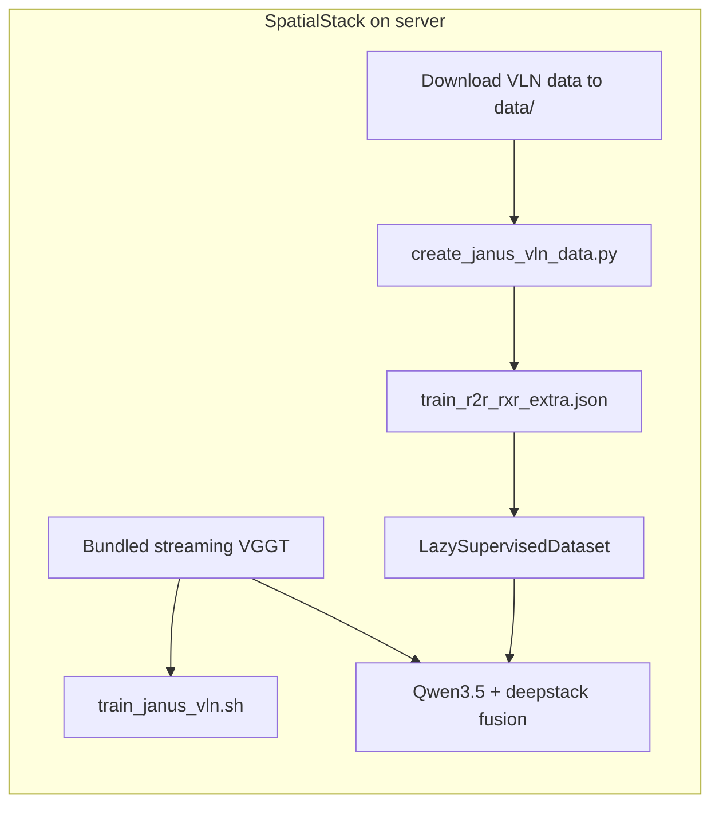

# Training SpatialStack on JanusVLN VLN Data (SpatialStack-only Server Guide)

Fine-tune **SpatialStack Qwen3.5** on JanusVLN-style VLN navigation data.

**You only need to upload SpatialStack** to the training server. This repo includes:

- **Streaming VGGT** (frame-by-frame KV cache) under `src/qwen_vl/model/vggt/`
- **Data preparation script** at `scripts/data/create_janus_vln_data.py`
- **Training launcher** at `scripts/train/train_janus_vln.sh`

No JanusVLN code checkout is required on the server.

## What to upload

```
SpatialStack/          # this repo (code + scripts)
└── data/              # download on server OR rsync separately
    ├── datasets/      # VLN-CE episode .json.gz
    ├── trajectory_data/
    ├── dagger_data/   # only for extra set
    └── train/         # created by create_janus_vln_data.py
        └── train_r2r_rxr_extra.json
```

Install the SpatialStack environment per [TRAINING.md](TRAINING.md) / [README.md](README.md) (Python 3.12).

## Step 1 — Download VLN data on the server

Download into `SpatialStack/data/` following the [JanusVLN data layout](https://github.com/MIV-XJTU/JanusVLN#-data-preparation):

1. **VLN-CE episodes** → `data/datasets/r2r/`, `data/datasets/rxr/`
2. **Trajectory data** from [ModelScope: JanusVLN_Trajectory_Data](https://www.modelscope.cn/datasets/misstl/JanusVLN_Trajectory_Data) → `data/trajectory_data/`
3. **DAgger data** (extra set only) → `data/dagger_data/`

Fix the R2R/RxR directory name mismatch after download:

```bash
cd SpatialStack
mkdir -p data/trajectory_data/R2R data/trajectory_data/RxR
ln -sfn ../R2R-CE-640x480/images data/trajectory_data/R2R/train
ln -sfn ../RxR-CE-640x480/images data/trajectory_data/RxR/train
```

**Alternative:** If you already have a pre-built `train_r2r_rxr_extra.json` and images on the server, skip to Step 3 and set `VLN_ANNOTATION` / `VLN_DATA_ROOT`.

## Step 2 — Build the training manifest

From the SpatialStack repo root:

```bash
# Base set (R2R + RxR only)
python scripts/data/create_janus_vln_data.py --data_root .

# Full extra set (R2R + RxR + ScaleVLN + DAgger)
python scripts/data/create_janus_vln_data.py --data_root . --use_extra_data
```

Output defaults to `data/train/train_r2r_rxr_extra.json`. Image paths inside the JSON are **relative to the SpatialStack root** (e.g. `data/trajectory_data/R2R/train/...`).

Smoke-test:

```python
import json, os
root = "."  # SpatialStack root
data = json.load(open("data/train/train_r2r_rxr_extra.json"))
s = data[0]
for p in s["images"]:
    assert os.path.exists(os.path.join(root, p)), p
print("OK", s["id"], len(s["images"]), "frames")
```

## Using an existing JanusVLN JSON (your server layout)

If you already have JanusVLN-style data (same as `TRAIN_R2R_RxR` in JanusVLN):

```python
TRAIN_R2R_RxR = {
    "annotation_path": "/mnt/data/vmo-ai-task/anhdh35/JanusVLN/train_r2r_rxr.json",
    "data_path": "/mnt/data/vmo-ai-task/anhdh35/JanusVLN",
    "tag": "train_r2r_rxr",
}
```

**No need to copy JSON into SpatialStack** — set env vars and train:

```bash
export VLN_DATA_ROOT=/mnt/data/vmo-ai-task/anhdh35/JanusVLN
export VLN_ANNOTATION=/mnt/data/vmo-ai-task/anhdh35/JanusVLN/train_r2r_rxr.json

# JanusVLN-compatible dataset name
export DATASETS=train_r2r_rxr%100

bash scripts/train/train_janus_vln.sh
```

Equivalent names:

| JanusVLN `DATASETS` | SpatialStack alias |
|---------------------|-------------------|
| `train_r2r_rxr` | `train_r2r_rxr` or `janus_vln_base` |
| `train_r2r_rxr_extra` | `train_r2r_rxr_extra` or `janus_vln_extra` |

`tag` in JSON config (`train_r2r_rxr` vs `3d`) only affects length grouping; SpatialStack uses `tag: 3d` internally — both work for VLN-only training.

**Sanity check** (image paths in JSON must resolve under `data_path`):

```bash
python -c "
import json, os
root = '/mnt/data/vmo-ai-task/anhdh35/JanusVLN'
ann = root + '/train_r2r_rxr.json'
s = json.load(open(ann))[0]
for p in s['images']:
    fp = p if os.path.isabs(p) else os.path.join(root, p)
    assert os.path.isfile(fp), fp
print('OK', s['id'], len(s['images']), 'frames')
"
```

## Step 3 — Streaming VGGT (built-in)

SpatialStack bundles **streaming VGGT** under `src/qwen_vl/model/vggt/` (KV-cache aggregator, 644px `load_fn.py`). No JanusVLN checkout or setup script is required.

```bash
bash scripts/verify_streaming_vggt.sh
```

Training enables it via `--geometry_encoder_streaming True`. The pipeline:

1. Each VLN frame is preprocessed at **644px** for VGGT (full size, before Qwen grid trim).
2. Frames are fed **sequentially** through the aggregator with `use_cache=True`.
3. Geometry from the **last frame** (with history in KV cache) is **tiled** across all image tokens in the prompt (history + current), matching JanusVLN behavior.

## Step 4 — Launch training

### Train from Qwen3.5 base (JanusVLN-style, default)

Same idea as JanusVLN `train.sh`: start from **`Qwen/Qwen3.5-4B`**, not the SpatialStack checkpoint. VGGT stays frozen; LLM + projector + geometry fusion modules are trained on VLN data.

```bash
cd SpatialStack

export VLN_DATA_ROOT=/mnt/data/vmo-ai-task/anhdh35/JanusVLN
export VLN_ANNOTATION=/mnt/data/vmo-ai-task/anhdh35/JanusVLN/train_r2r_rxr.json
export DATASETS=train_r2r_rxr%100

export VLN_TRAIN_MODE=train          # default
export MODEL_PATH=Qwen/Qwen3.5-4B    # default when VLN_TRAIN_MODE=train
export OUTPUT_DIR=./output/spatialstack_janus_vln_train
export TOTAL_BATCH_SIZE=64
export CUDA_VISIBLE_DEVICES=0,1,2,3

bash scripts/train/train_janus_vln.sh
```

### Fine-tune from SpatialStack checkpoint (optional)

If you already have `Journey9ni/SpatialStack-Qwen3.5-4B` (spatial QA pre-trained):

```bash
export VLN_TRAIN_MODE=finetune
export MODEL_PATH=Journey9ni/SpatialStack-Qwen3.5-4B
export OUTPUT_DIR=./output/spatialstack_janus_vln_finetune
bash scripts/train/train_janus_vln.sh
```

| `VLN_TRAIN_MODE` | Default `MODEL_PATH` | Use when |
|------------------|----------------------|----------|
| `train` (default) | `Qwen/Qwen3.5-4B` | JanusVLN-style VLN training from base VLM |
| `finetune` | `Journey9ni/SpatialStack-Qwen3.5-4B` | Adapt SpatialStack to VLN after spatial QA training |

Both modes use the same VLN data, streaming VGGT, and `tune_mm_llm=True`, `tune_mm_mlp=True`, `tune_mm_vision=False` (same as JanusVLN).

### Environment variables

| Variable | Default | Purpose |
|----------|---------|---------|
| `VLN_TRAIN_MODE` | `train` | `train` = Qwen3.5 base; `finetune` = SpatialStack checkpoint |
| `VLN_DATA_ROOT` | `.` | Root for resolving relative image paths in the JSON |
| `VLN_ANNOTATION` | `data/train/train_r2r_rxr_extra.json` | Training manifest path |
| `DATASETS` | `train_r2r_rxr%100` | Dataset alias; use `train_r2r_rxr_extra%100` for extra set |
| `GEOMETRY_ENCODER_STREAMING` | `true` | Frame-by-frame VGGT (keep on for VLN) |

### Key training settings

| Setting | Value | Why |
|---------|-------|-----|
| `model_max_length` | `163840` | Up to 9 images per VLN sample |
| `geometry_encoder_streaming` | `True` | Sequential VGGT with KV cache |
| `reference_frame` | `first` | VGGT memory aligned with JanusVLN |
| `tune_mm_mlp` | `True` | Tune vision-language projector |
| `tag` | `3d` | Required for geometry encoder batching |

## Step 5 — Smoke test

Subsample the JSON to ~100 entries, then:

```bash
export TOTAL_BATCH_SIZE=1
export OUTPUT_DIR=./output/spatialstack_vln_smoke
bash scripts/train/train_janus_vln.sh
```

Check the log for:
- Dataset loads without `FileNotFoundError`
- `OK: streaming VGGT is bundled`
- Loss decreases over a few steps

## Debugging the pipeline

Use a **layered** approach: data only → collator shapes → one forward → short training.

### 1. Debug script (no full training)

From the repo root, after data is prepared:

```bash
# Print shapes, tiling check, save Qwen vs VGGT frame PNGs
python scripts/debug/debug_vln_pipeline.py --sample_idx 0 \
  --out_dir ./debug_vln_output

# Same + one GPU forward pass (catches tiling / fusion errors)
python scripts/debug/debug_vln_pipeline.py --sample_idx 0 --run_forward \
  --model_path Journey9ni/SpatialStack-Qwen3.5-4B \
  --out_dir ./debug_vln_output
```

Outputs under `./debug_vln_output/`:
- `frames/frame_XX_qwen.png` — Qwen-trimmed input per frame
- `frames/frame_XX_vggt_644.png` — full 644px VGGT input per frame
- Console: token counts, geometry `[S,C,H,W]`, **tiling factor** (should equal number of frames)

**Critical check** in the script output:

```text
tiling factor (vision/geo): 9  (expect = num frames)
```

If you see `WARNING: vision tokens not divisible by geo merged`, training will fail at fusion.

### 1b. VGGT batch vs streaming KV cache

```bash
python scripts/debug/compare_vggt_batch_vs_streaming.py --num_frames 9
```

| Check | Expected |
|-------|----------|
| `[1] Streaming reproducibility` | **OK** (max_abs=0) |
| `[2] encode_layers_streaming() ×2` | **OK** |
| `[3] Batch vs streaming` | **DIFF** is normal — VLN uses streaming only |
| `[4] S=1 use_cache vs no_cache` | **DIFF** is normal — different attention branches |

**PASS** means the KV-cache path used in VLN training is self-consistent. Batch `encode_layers()` is for spatial-QA (`geometry_encoder_streaming=False`) and is not numerically identical to streaming.

### 2. Small training run

```bash
export TOTAL_BATCH_SIZE=1
export OUTPUT_DIR=./output/smoke
# Optional: limit dataset size — add to train_janus_vln.sh train_args or pass to train_qwen.py:
#   --max_samples 20
# Easier stack traces:
#   --dataloader_num_workers 0
bash scripts/train/train_janus_vln.sh
```

Watch `OUTPUT_DIR/train.rank0.log` for:
- `[Try #0] Failed to fetch sample` — bad image paths
- `Cannot tile geometry` — Qwen vs VGGT grid mismatch
- `VGGT aggregator does not support streaming` — wrong VGGT files

### 3. Debug during training (built-in)

Enable with one env var — no code edits:

```bash
export VLN_DEBUG=1
export TOTAL_BATCH_SIZE=1          # optional: single-GPU smoke
export OUTPUT_DIR=./output/smoke

bash scripts/train/train_janus_vln.sh
```

This turns on `--debug_vln`, sets `dataloader_num_workers=0`, and writes to `$OUTPUT_DIR/debug_vln/`.

**Save / print interval:** debug logs and images are written only every **100 training steps** by default (not every step or epoch). Change with:

```bash
export VLN_DEBUG_SAVE_INTERVAL=100   # steps between debug dumps (default 100)
```

**Log lines** (rank 0 only, prefix `[VLN_DEBUG]`, at steps 100, 200, 300, …):

| Stage | What is logged |
|-------|----------------|
| Dataset `__getitem__` | frames, `grid_thw`, geo shapes, action label |
| Collator | batched geometry `[S,C,H,W]`, vision token counts |
| Streaming VGGT | `S`, patch grid, merged geo token shape |
| LM fusion (layer 0) | vision vs geo shapes, tiling factor |

**Saved images** (`$OUTPUT_DIR/debug_vln/frames/sample_XXXXX_idxN/`):

- `frame_XX_raw.png` — original dataset frame
- `frame_XX_vggt_644.png` — 644px tensor fed to VGGT

**Geometry encoder layer visuals** (`$OUTPUT_DIR/debug_vln/geometry_layers/step_000100/`, `step_000200/`, …):

For each `geometry_encoder_layers` index (default **11, 17, 23**):

| File | Meaning |
|------|---------|
| `layer_11_heatmap.png` | L2-norm of patch tokens reshaped to a grid (pseudo-depth / saliency) |
| `layer_11_overlay.png` | Heatmap blended over the input RGB (last frame in streaming mode) |

These are **not** metric depth — they show where each aggregator layer activates. Deeper layers (17, 23) often look smoother / more semantic.

**Real VGGT depth** (optional, slower — loads DPT `depth_head`):

```bash
export VLN_DEBUG=1
export VLN_DEBUG_DEPTH=1
bash scripts/train/train_janus_vln.sh
```

Saves under `$OUTPUT_DIR/debug_vln/depth/step_000100/`, …:

- `frame_XX_depth.png` — colormapped inverse depth (nearer = warmer)
- `frame_XX_depth_overlay.png` — depth blended on RGB

**Tunables:**

```bash
VLN_DEBUG_SAVE_INTERVAL=100   # dump every N training steps (default 100)
VLN_DEBUG_DEPTH=1            # also save real VGGT DPT depth maps
```

Or pass CLI flags directly to `train_qwen.py`:

```bash
--debug_vln True \
--debug_vln_save_dir ./output/smoke/debug_vln \
--debug_vln_save_interval 100 \
--debug_vln_save_geo_layers True
```

Implementation: [`src/qwen_vl/debug/vln_debug.py`](src/qwen_vl/debug/vln_debug.py).

### 4. Offline debug script (no training)

[`scripts/debug/debug_vln_pipeline.py`](scripts/debug/debug_vln_pipeline.py) — same checks without launching training:

```bash
python scripts/debug/debug_vln_pipeline.py --sample_idx 0 \
  --out_dir ./debug_vln_output
```

### 5. What to verify

| Check | Expected |
|-------|----------|
| VGGT image size | ~644px width, saved as `vggt_644.png` |
| Qwen image | Smaller trimmed tensor, `qwen.png` |
| `geometry_encoder_inputs` stack | `[S, 3, H, W]` with S = number of `<image>` tokens |
| Tiling factor | Equals S (e.g. 9 for full history) |
| Trainable label | Single action string (`MOVE_FORWARD`, etc.) |
| Forward pass | Completes without shape error; loss is finite |

## Notes

- **Weights**: VLN **training** uses `Qwen/Qwen3.5-4B` (default). **Fine-tuning** uses `Journey9ni/SpatialStack-Qwen3.5-4B`. JanusVLN_Base (Qwen2.5-VL) weights are not compatible.
- **VLN evaluation**: SpatialStack eval benchmarks are spatial-QA, not navigation. For R2R/RxR metrics you need a separate Habitat eval pipeline.
- **Compute**: Full extra set is multi-million samples; use multi-GPU + DeepSpeed ZeRO-2. Switch to ZeRO-3 if OOM at `model_max_length=163840`.

## Architecture


